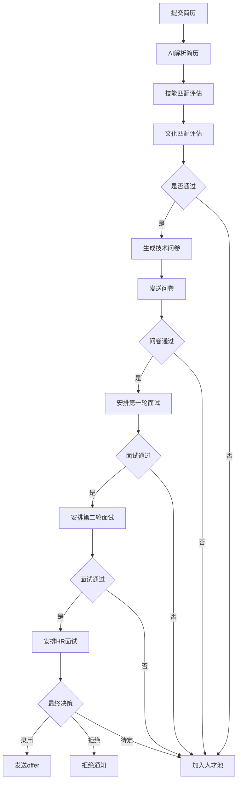
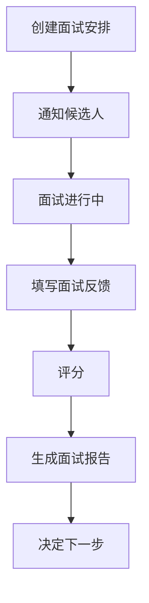

## 1. 产品概述
AI招聘系统管理后台是一个面向HR和招聘人员的企业级应用，提供一站式招聘流程管理解决方案。系统集成AI能力，实现简历智能解析、自动匹配、智能面试等功能，提升招聘效率和质量。

- 核心目标：帮助企业实现招聘流程数字化、智能化，减少人工重复工作
- 目标用户：HR人员、招聘专员、部门负责人、系统管理员
- 市场价值：提升招聘效率30%以上，降低招聘成本，提高人才匹配准确度

## 2. 核心功能

### 2.1 用户角色
| 角色 | 注册方式 | 核心权限 |
|------|----------|----------|
| 管理员 | 后台创建 | 系统管理、用户管理、全部功能 |
| HR人员 | 注册/邀请 | 候选人管理、面试安排、评估 |
| 面试官 | 注册/邀请 | 查看候选人、填写评估 |
| 查看者 | 注册/邀请 | 只读查看数据 |

### 2.2 功能模块
1. **数据仪表盘**：核心KPI展示、实时统计、趋势分析
2. **候选人管理**：候选人列表、简历上传、AI解析、匹配度评估
3. **面试管理**：面试安排、进度跟踪、反馈收集
4. **问卷管理**：问卷创建、分发、评分
5. **评估管理**：多维度评估、综合评分、评估报告
6. **人才池**：候选人沉淀、标签管理、定期联系
7. **知识库**：企业制度查询、RAG问答
8. **系统设置**：用户管理、角色权限

### 2.3 页面详情
| 页面名称 | 模块名称 | 功能描述 |
|----------|----------|----------|
| 数据仪表盘 | 概览卡片 | 展示候选人总数、面试进度、招聘效率等核心指标 |
| 数据仪表盘 | 趋势图表 | 周/月候选人增长趋势、面试完成率趋势 |
| 候选人管理 | 列表页 | 候选人列表、筛选、搜索、批量操作 |
| 候选人管理 | 详情页 | 简历详情、AI解析结果、匹配度报告、工作流状态 |
| 面试管理 | 列表页 | 面试安排列表、状态筛选、时间线 |
| 面试管理 | 安排页 | 创建面试、选择面试官、设置时间 |
| 问卷管理 | 列表页 | 问卷列表、创建、编辑、删除 |
| 问卷管理 | 创建页 | AI生成问卷、自定义题目 |
| 评估管理 | 列表页 | 评估记录、筛选、统计 |
| 评估管理 | 详情页 | 多维度评分、评语输入 |
| 人才池 | 列表页 | 人才列表、标签筛选、联系记录 |
| 知识库 | 问答页 | 企业制度查询、RAG检索 |
| 系统设置 | 用户管理 | 用户列表、角色分配、权限管理 |

## 3. 核心流程

### 3.1 候选人入职流程

### 3.2 面试流程

## 4. 用户界面设计

### 4.1 设计风格
- **主色调**：深蓝色系（#1e3a5f）作为主色，配合青绿色（#10b981）作为强调色
- **按钮风格**：圆角矩形，悬停有阴影效果，主按钮渐变背景
- **字体**：使用 Inter 作为主字体，清晰易读
- **布局**：左侧导航栏 + 右侧内容区，卡片式布局
- **图标**：使用 Lucide React 图标库
- **整体风格**：专业、简洁、现代的企业级管理后台风格

### 4.2 页面设计概览
| 页面名称 | 模块名称 | UI元素 |
|----------|----------|--------|
| 数据仪表盘 | 概览卡片 | 统计数字、进度条、趋势图、卡片悬浮效果 |
| 候选人管理 | 列表页 | 表格展示、筛选器、操作按钮、状态标签 |
| 候选人管理 | 详情页 | 标签页切换、简历预览、匹配度雷达图 |
| 面试管理 | 列表页 | 时间线视图、状态图标、批量操作 |
| 问卷管理 | 创建页 | 富文本编辑器、AI生成按钮、实时预览 |

### 4.3 响应式设计
- 桌面端优先设计
- 支持1280px以上宽度的显示器
- 侧边栏可折叠
- 表格支持横向滚动

### 4.4 交互设计
- 页面切换使用平滑过渡动画
- 列表项悬停高亮效果
- 表单验证实时反馈
- 模态框居中显示，背景模糊
- 加载状态显示骨架屏
