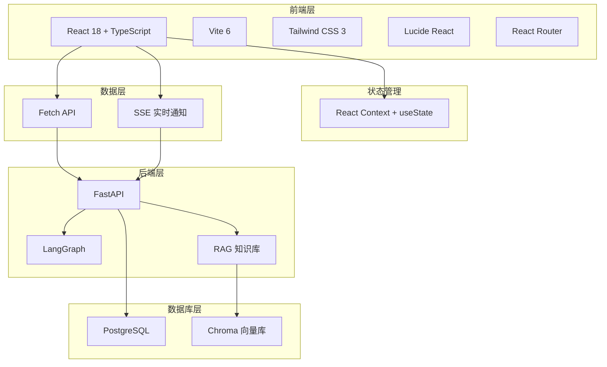
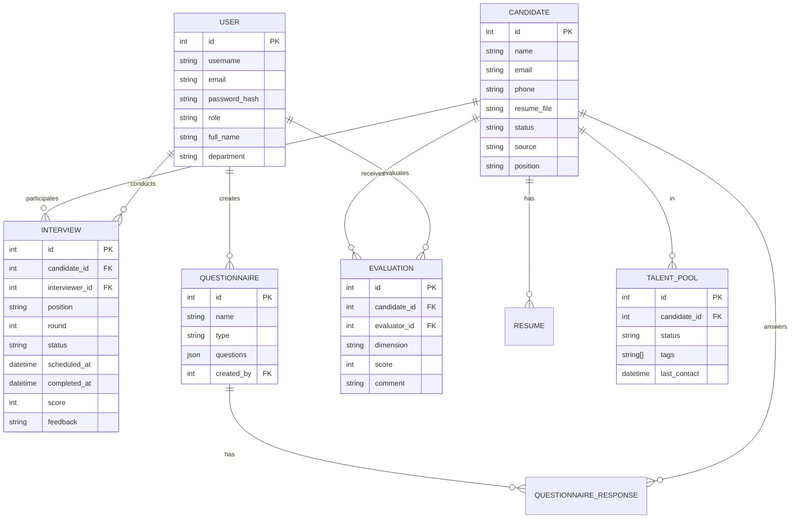

## 1. 架构设计



## 2. 技术描述
- **前端框架**: React 18 + TypeScript
- **构建工具**: Vite 6
- **样式框架**: Tailwind CSS 3
- **图标库**: Lucide React
- **路由**: React Router DOM
- **状态管理**: React Context + useState
- **HTTP请求**: Fetch API
- **实时通知**: SSE (Server-Sent Events)

## 3. 路由定义
| 路由 | 页面组件 | 功能描述 |
|------|----------|----------|
| / | Dashboard | 数据仪表盘 |
| /candidates | Candidates | 候选人列表 |
| /candidates/:id | CandidateDetail | 候选人详情 |
| /interviews | Interviews | 面试管理 |
| /questionnaires | Questionnaires | 问卷管理 |
| /evaluations | Evaluations | 评估管理 |
| /talent-pool | TalentPool | 人才池 |
| /knowledge-base | KnowledgeBase | 知识库 |
| /settings | Settings | 系统设置 |
| /login | Login | 登录页面 |

## 4. API 定义

### 4.1 认证接口
```typescript
interface LoginRequest {
    username: string;
    password: string;
}

interface TokenResponse {
    access_token: string;
    token_type: string;
}

interface User {
    id: number;
    username: string;
    email: string;
    full_name: string | null;
    department: string | null;
    role: string;
    created_at: string;
}
```

### 4.2 候选人接口
```typescript
interface Candidate {
    id: number;
    name: string;
    email: string | null;
    phone: string | null;
    resume_file: string | null;
    status: string;
    source: string | null;
    position: string | null;
    created_at: string;
    updated_at: string;
}

interface Resume {
    id: number;
    candidate_id: number;
    file_name: string;
    skills: string[] | null;
    experience: string | null;
    education: string | null;
    created_at: string;
}
```

### 4.3 面试接口
```typescript
interface Interview {
    id: number;
    candidate_id: number;
    position: string;
    round: number;
    status: string;
    interviewer_id: number | null;
    scheduled_at: string | null;
    completed_at: string | null;
    score: number | null;
    feedback: string | null;
    created_at: string;
}
```

### 4.4 仪表盘统计
```typescript
interface DashboardStats {
    total_candidates: number;
    pending_candidates: number;
    interviewed_candidates: number;
    hired_candidates: number;
    avg_interview_time: number;
    avg_match_score: number;
    this_month_candidates: number;
    interview_progress: { status: string; count: number }[];
}
```

## 5. 项目结构
```
src/
├── components/
│   ├── Layout/
│   │   ├── Sidebar.tsx
│   │   ├── Header.tsx
│   │   └── Layout.tsx
│   ├── Common/
│   │   ├── Button.tsx
│   │   ├── Card.tsx
│   │   ├── Table.tsx
│   │   ├── Modal.tsx
│   │   └── Loading.tsx
│   └── Dashboard/
│       ├── StatCard.tsx
│       └── TrendChart.tsx
├── pages/
│   ├── Login.tsx
│   ├── Dashboard.tsx
│   ├── Candidates.tsx
│   ├── CandidateDetail.tsx
│   ├── Interviews.tsx
│   ├── Questionnaires.tsx
│   ├── Evaluations.tsx
│   ├── TalentPool.tsx
│   ├── KnowledgeBase.tsx
│   └── Settings.tsx
├── services/
│   ├── api.ts
│   ├── auth.ts
│   ├── candidates.ts
│   ├── interviews.ts
│   ├── questionnaires.ts
│   ├── evaluations.ts
│   └── dashboard.ts
├── context/
│   └── AuthContext.tsx
├── types/
│   └── index.ts
├── App.tsx
├── main.tsx
└── index.css
```

## 6. 数据模型

